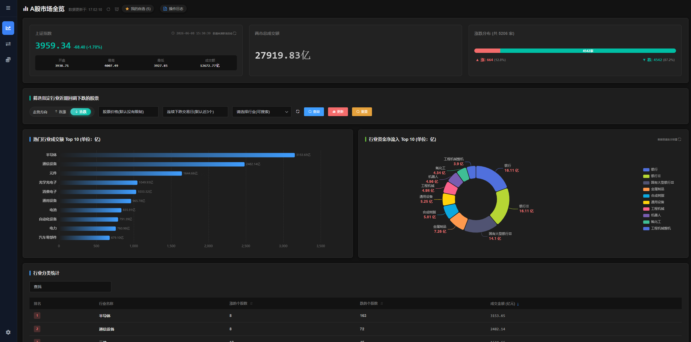
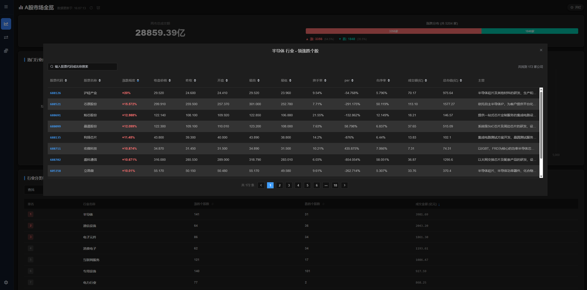
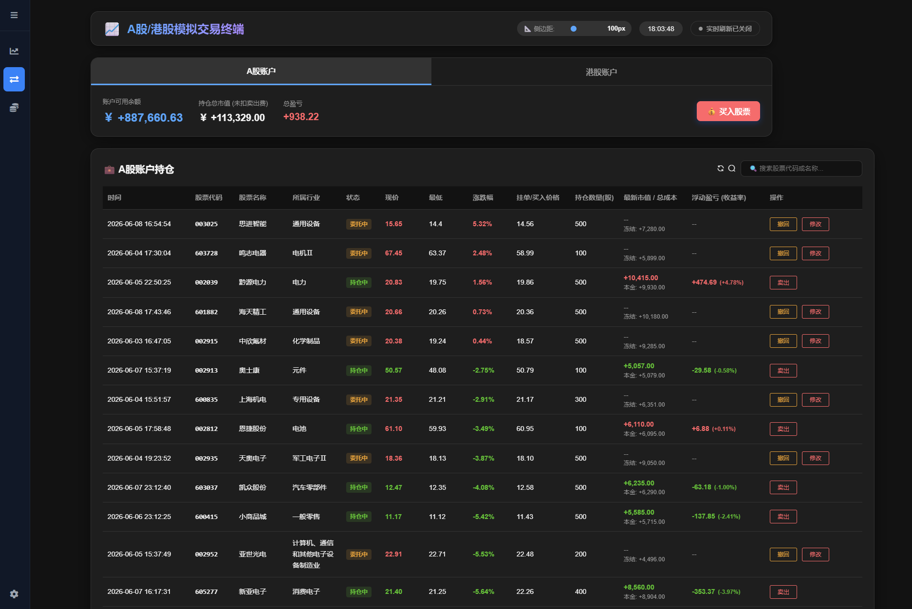
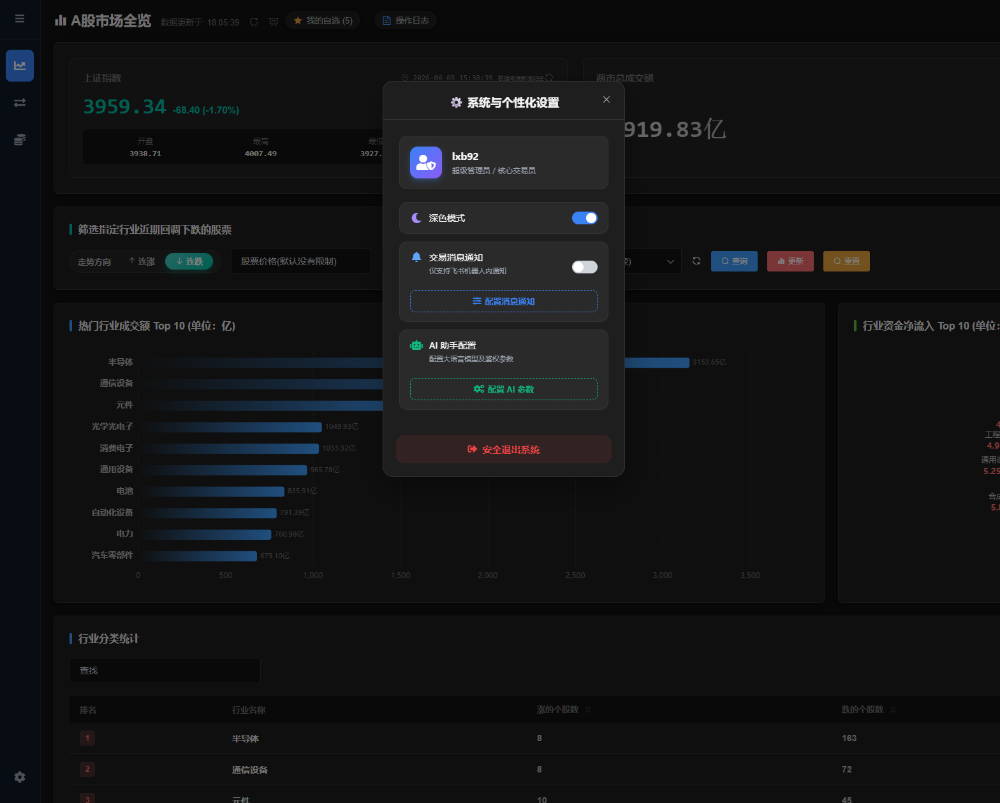
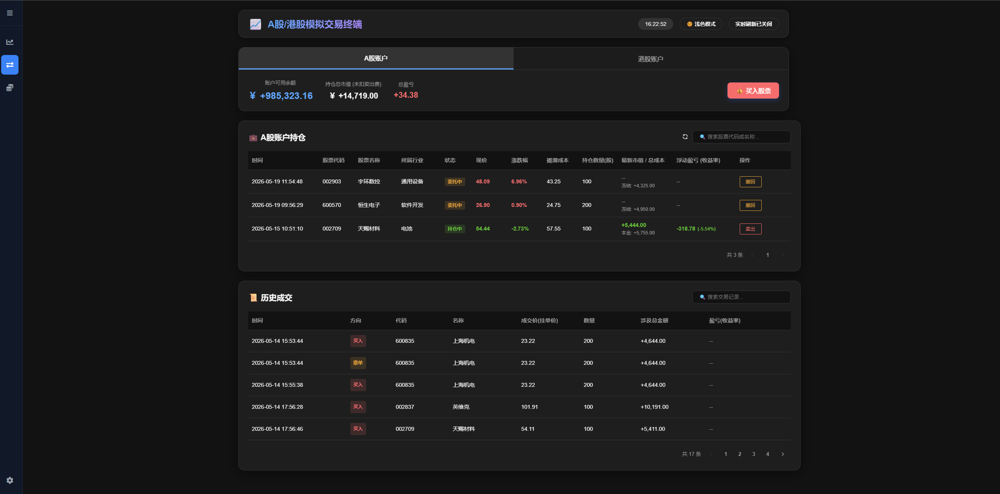
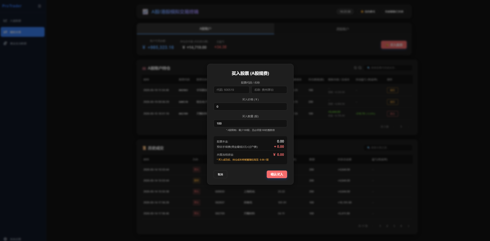
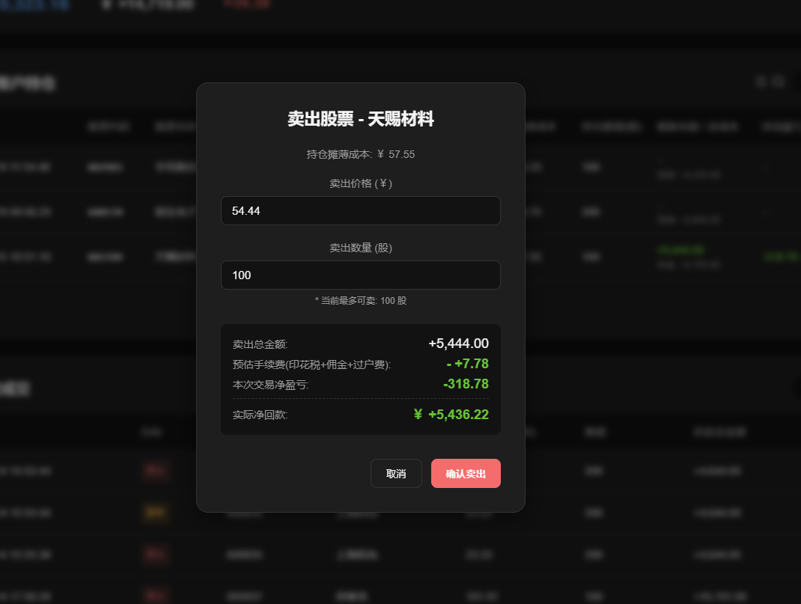
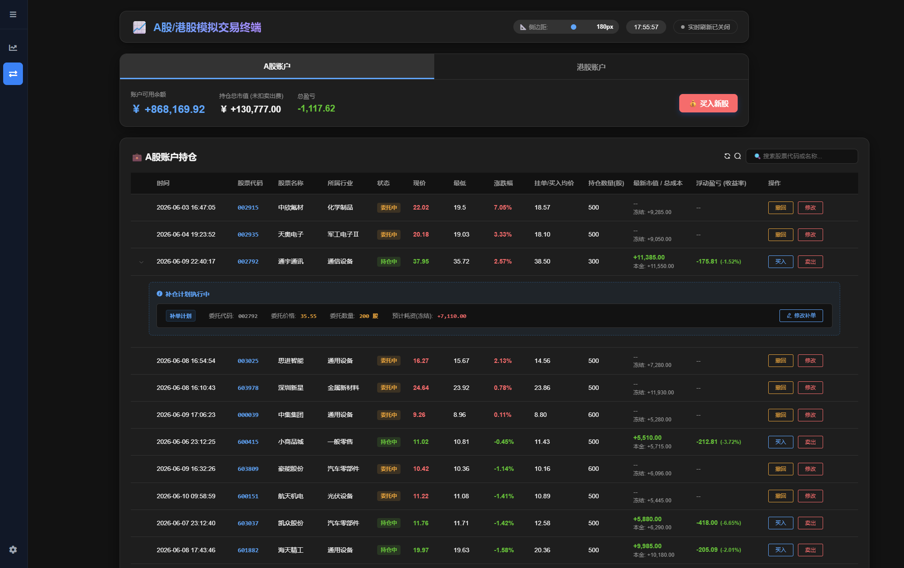

## ProTrader - Stock Frontend

基于 Vue 2 + Element-UI 的股票信息可视化与模拟交易前端，面向研究/演示场景：大盘汇总、行业热度、资金流入、个股历史分析、模拟账户交易、AI 辅助分析与飞书推送。

主要目录（简要）：
- `src/`：源码（views/components/router/store/api 等）
- `public/`：静态资源
- `style/`：样式文件
- `k8s/`：Kubernetes 清单（示例）

### 快速开始

```bash
npm install
npm run serve
```

构建：

```bash
npm run build
```

### 主要页面（概要）
- MarketOverview: [src/views/stock/stockTotal.vue](src/views/stock/stockTotal.vue#L1) — 大盘/行业/资金流、条件筛选、基于历史数据的AI详细分析
- StockTrading: [src/views/stock/stockTrade.vue](src/views/stock/stockTrade.vue#L1) — 模拟交易（持仓、委托、历史）
- Admin: [src/views/admin/admin.vue](src/views/admin/admin.vue#L1) — 系统设置、飞书与 AI 配置

## 后端 API（从组件 import 注释整理）
以下为组件中直接 import 并带注释的后端 API 列表，按函数名 → 功能说明 → 调用页面归属整理，便于后端对接与前端联调：

- `get_stock_industry_up_down`
  - 功能：获取所有行业所属股票的涨跌/成交额数据
  - 调用页：MarketOverview ([src/views/stock/stockTotal.vue](src/views/stock/stockTotal.vue#L800))

- `get_stock_market_data`
  - 功能：获取两市总览聚合数据
  - 调用页：MarketOverview

- `stock_data_switch`
  - 功能：两市所有股票的实时数据开关/触发
  - 调用页：MarketOverview

- `stock_data_status`
  - 功能：检测两市实时数据是否已准备完成
  - 调用页：MarketOverview

- `get_industry_data`
  - 功能：注释为“未使用（占位）”

- `get_stock_info_data`
  - 功能：获取个股基础信息（名称、行业等），用于填写买入表单与详情
  - 调用页：MarketOverview、StockTrading、StockDashboard

- `get_stock_industry_list`
  - 功能：注释为“未使用（占位）”

- `filter_good_stocks`
  - 功能：查询满足条件的优质股票（前端“筛选指定行业连续上涨/下跌”使用）
  - 调用页：MarketOverview

- `filter_good_stocks_history`
  - 功能：查询优质股票的历史回溯数据
  - 调用页：MarketOverview

- `stock_history_data_date_range`
  - 功能：查询个股历史数据可用的日期范围
  - 调用页：MarketOverview（区间查询功能）

- `get_sh_index`
  - 功能：获取上证指数（示例来源：新浪财经）
  - 调用页：MarketOverview（上证看板）

- `get_capital_inflow`
  - 功能：实时获取行业资金流入/流出数据
  - 调用页：MarketOverview（资金流向图表）

- `get_stock_rt_data` / `get_stock_rt_data_v2`
  - 功能：获取单只股票实时数据（用于弹窗详情与单股查询）
  - 调用页：StockTrading、MarketOverview、StockDashboard

- `get_stock_real_time_data`
  - 功能：按代码获取实时数据并用于添加自选或单股查询
  - 调用页：StockTrading、StockDashboard

- `get_stock_real_time_list`
  - 功能：批量拉取实时数据列表（用于刷新持仓/自选）
  - 调用页：StockTrading、StockDashboard

- `stock_real_time_switch`
  - 功能：控制实时刷新开关（开启/关闭）
  - 调用页：StockTrading

- `update_trade_status`
  - 功能：更新持仓/委托状态（撤单、成交、状态变更）
  - 调用页：StockTrading（撤单、卖出、订单变更）

- `add_self_selected_stock`
  - 功能：添加自选股到用户自选列表
  - 调用页：MarketOverview / StockDashboard

- `del_self_selected_stock` / `del_self_selected_stock_v2`
  - 功能：删除/取消关注自选股
  - 调用页：StockDashboard、MarketOverview

- `get_self_selected_stocks`
  - 功能：获取用户自选股票列表
  - 调用页：MarketOverview（我的自选弹窗）

- `change_holding_data`
  - 功能：修改挂单（价格/数量）数据
  - 调用页：StockTrading（修改挂单、加仓）

- `get_stock_history_data`
  - 功能：获取个股历史 K 线/日线数据，用于绘图与极值计算
  - 调用页：MarketOverview（历史折线、极值面板）

- `stock_notice_switch`
  - 功能：切换股票消息通知（飞书机器人开/关）
  - 调用页：Admin ([src/views/admin/admin.vue](src/views/admin/admin.vue#L1))

- `send_feishu_msg`
  - 功能：向飞书机器人发送测试消息
  - 调用页：Admin（飞书配置弹窗）

- `feishu_config`
  - 功能：保存/提交飞书机器人配置（webhook、关键词）
  - 调用页：Admin

- `get_ai_config`
  - 功能：拉取后端保存的 AI 参数配置
  - 调用页：Admin、MarketOverview（初始化 AI 设置）

- `set_ai_config`
  - 功能：保存/提交 AI 配置（mode/preset/apiKey/apiUrl/model）
  - 调用页：Admin（保存 AI 配置）

## 管理页面（AI / 飞书）配置说明
- 飞书：需要填写 `webhook` 与 `keyword`，后端 `feishu_config` 用于保存，`send_feishu_msg` 用于测试消息。
- AI：支持 `local` 与 `api` 模式，若选择 `api`，在 `Admin` 中填写 `preset`、`apiUrl`、`apiKey` 与 `model`，并通过 `set_ai_config` 保存；前端会优先读取本地 `localStorage` 的 `stock_ai_config`，若无则调用 `get_ai_config`。

## 开发与对接建议
- 后端接口返回遵循统一 JSON 结构（示例）：

```json
{ "code": 1000, "msg": "success", "data": { ... } }
```

- 在 `src/api/index.js` 中对上述函数做统一封装（axios 实例、基础错误处理、超时、重试等）。
- 本地调试时可通过 `vue.config.js` 的 `devServer.proxy` 配置代理到后端，避免 CORS 问题。

## 我可以继续为你做的事
- 将每个后端接口补成 `src/api` 的 stub/文档（带请求示例与返回样例）。
- 把 API 列表导出为 `docs/API.md` 或自动生成的 Postman/Swagger 示例。
- 为 Admin 的 AI 配置生成示例页面截图与填写模板。

---

## 项目截图

下面展示项目中的关键页面截图，帮助快速了解 UI 与布局（图片位于 `img/` 目录）：

- 持仓/账户面板（持仓列表与补仓条目）



- 买入弹窗（示例：委托买入）



- 卖出弹窗（示例：卖出确认）



- 大盘概览（上证指数、两市成交额、涨跌分布与行业图表）



- 仪表板（持仓表格示例）



- 仪表板 - 不同视图示例（滚动视图）



- 个股历史与 AI 终端弹窗（历史事件 + 模型选择）



- 系统设置弹窗（飞书 / AI 配置入口）




已将 README 更新为包含组件级 API 说明与项目截图。如需我也生成 `src/api/index.js` 的函数 stub，请告诉我.
